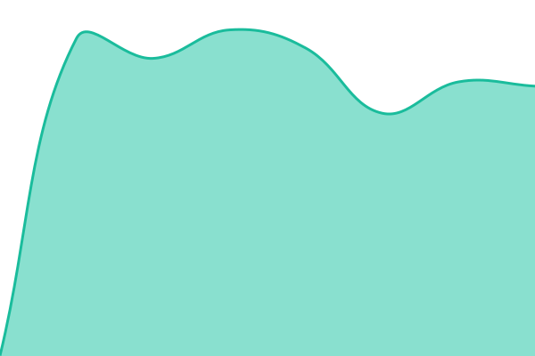
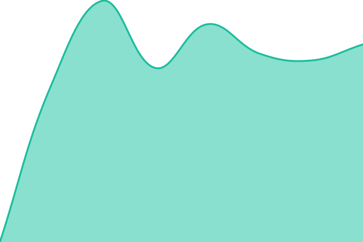
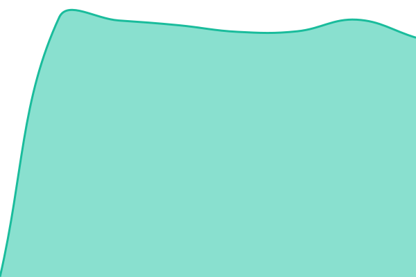
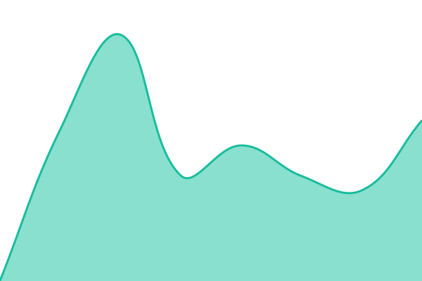

# [📈 Live Status](https://gemaramis.github.io/status-kejutan): <!--live status--> **🟩 All systems operational**

This repository contains the open-source uptime monitor and status page for [Ge](https://gemaramis.github.io/status-kejutan), powered by [Upptime](https://github.com/upptime/upptime).

With [Upptime](https://upptime.js.org), you can get your own unlimited and free uptime monitor and status page, powered entirely by a GitHub repository. We use [Issues](https://github.com/gemaramis/status-kejutan/issues) as incident reports, [Actions](https://github.com/gemaramis/status-kejutan/actions) as uptime monitors, and [Pages](https://gemaramis.github.io/status-kejutan) for the status page.

<!--start: status pages-->
<!-- This summary is generated by Upptime (https://github.com/upptime/upptime) -->
<!-- Do not edit this manually, your changes will be overwritten -->
<!-- prettier-ignore -->
| URL | Status | History | Response Time | Uptime |
| --- | ------ | ------- | ------------- | ------ |
|  [KEJUTAN Production](https://www.olxmobbi.my.id) | 🟩 Up | [kejutan-production.yml](https://github.com/gemaramis/status-kejutan/commits/HEAD/history/kejutan-production.yml) | 

 640ms
     
 | 

<a href="https://gemaramis.github.io/status-kejutan/history/kejutan-production">100.00%</a>
    

|  [KEJUTAN Klaim](https://klaimkejutan.olxmobbi.my.id/klaimkejutan) | 🟩 Up | [kejutan-klaim.yml](https://github.com/gemaramis/status-kejutan/commits/HEAD/history/kejutan-klaim.yml) | 

 516ms
     
 | 

<a href="https://gemaramis.github.io/status-kejutan/history/kejutan-klaim">99.35%</a>
    

|  [KEJUTAN API](https://www.olxmobbi.my.id/api/sesi) | 🟩 Up | [kejutan-api.yml](https://github.com/gemaramis/status-kejutan/commits/HEAD/history/kejutan-api.yml) | 

 837ms
     
 | 

<a href="https://gemaramis.github.io/status-kejutan/history/kejutan-api">100.00%</a>
    

|  [KEJUTAN Staging](https://staging.olxmobbi.my.id) | 🟩 Up | [kejutan-staging.yml](https://github.com/gemaramis/status-kejutan/commits/HEAD/history/kejutan-staging.yml) | 

 658ms
     
 | 

<a href="https://gemaramis.github.io/status-kejutan/history/kejutan-staging">100.00%</a>
    

<!--end: status pages-->

[**Visit our status website →**](https://gemaramis.github.io/status-kejutan)

## 📄 License

- Powered by: [Upptime](https://github.com/upptime/upptime)
- Code: [MIT](./LICENSE) © [Anand Chowdhary](https://anandchowdhary.com)
- Data in the `./history` directory: [Open Database License](https://opendatacommons.org/licenses/odbl/1-0/)
